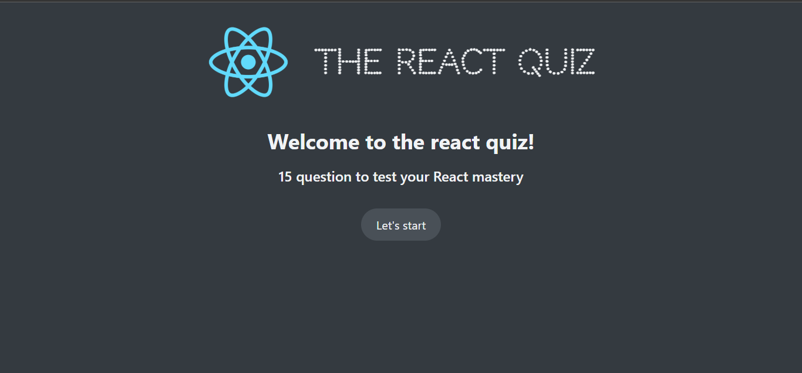

# 🧠 React Quiz App

A dynamic and interactive quiz application built with React. Users can start a quiz, answer multiple-choice questions, track their progress, see a countdown timer, and view their final score and high score at the end.

 <!-- Optional: Add a real screenshot if available -->

---

## 🚀 Features

- ✅ Fetches questions from an API (`http://localhost:8000/questions`)
- ✅ Displays one question at a time
- ✅ Multiple-choice answers with scoring logic
- ✅ Progress bar and timer for each question
- ✅ Final score screen with high score tracking
- ✅ Fully component-based architecture using React Hooks

---

## 🛠️ Tech Stack

- React
- JavaScript (ES6+)
- HTML5 & CSS3
- Custom hooks and reducer pattern (`useReducer`, `useEffect`)
- Local API simulation (`json-server` or similar)

---

## 📦 Getting Started

### Prerequisites

- Node.js and npm installed
- `json-server` for mock API (or replace with your own)

### Clone the repo

```bash
git clone https://github.com/ashutoshsitu02/Quiz.git
cd Quiz
npm install
```

### Start the development server

```bash
npm start
```

Runs the app at [http://localhost:3000](http://localhost:3000)

### Start the mock API server

In a separate terminal:

```bash
npx json-server --watch data/questions.json --port 8000
```

Ensure the `questions.json` file is located inside a `data` folder at the root.

---

## 🧪 Project Structure

```
src/
├── App.js             # Main app logic with reducer
├── components/        # UI components like Header, Question, Timer, etc.
├── data/              # (Optional) Questions data for json-server
├── index.js
└── index.css         # Your custom styles
```

---

## ✨ Screenshots

<!-- Optional -->

Add screenshots here to showcase the app UI.

---

## 📌 Future Improvements

- Add category/topic selection
- Store high scores in localStorage or backend
- Add sound effects or animations
- Add support for multiple quizzes

---

## 📄 License

This project is licensed under the MIT License – see the [LICENSE](LICENSE) file for details.

---

## 🙌 Acknowledgements

- [React Docs](https://reactjs.org/)
- [Create React App](https://create-react-app.dev/)
- [json-server](https://github.com/typicode/json-server)
